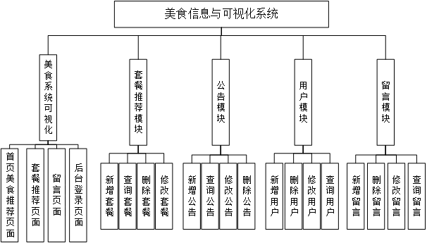
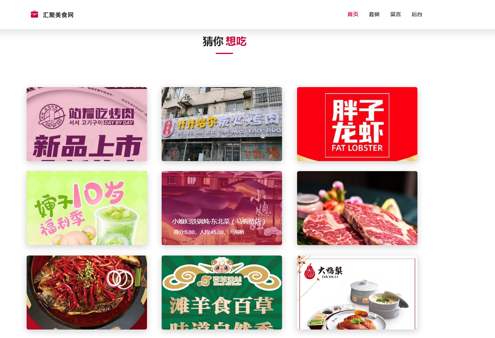
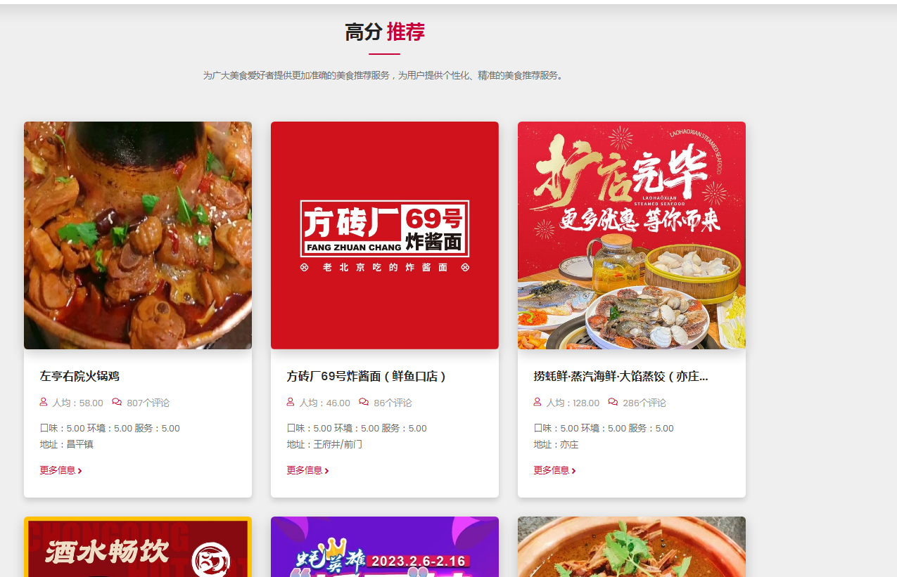
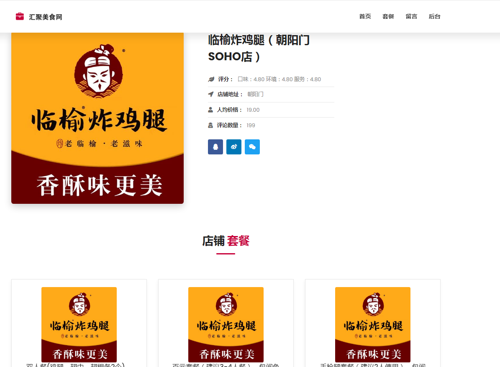
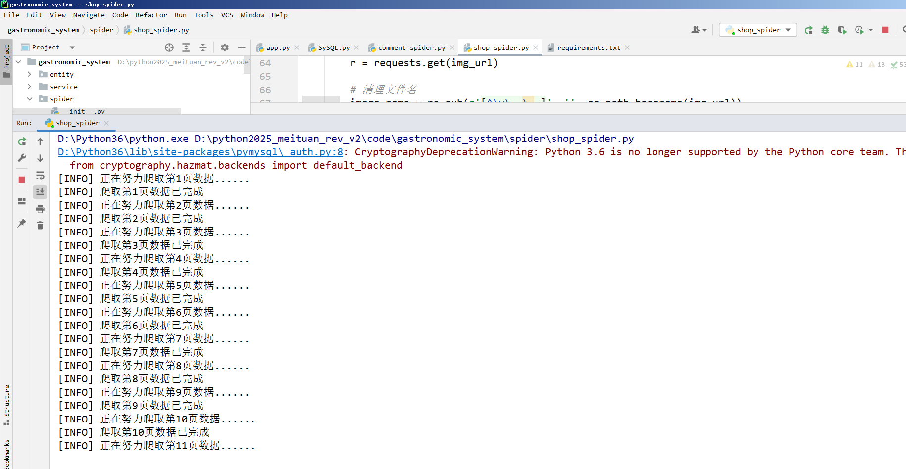
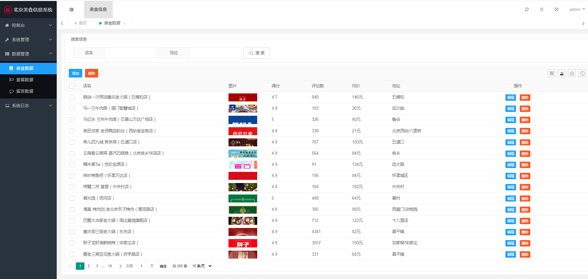
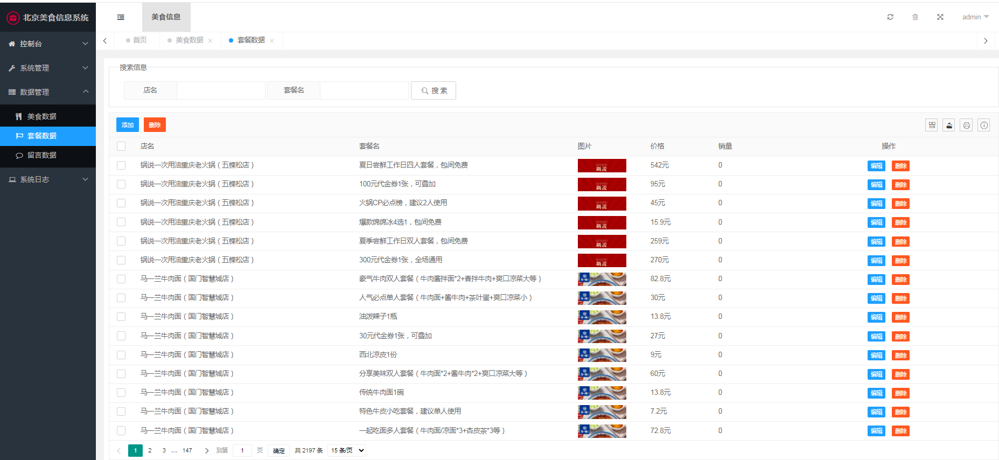

## 计算机毕业设计Python美食推荐系统 美团爬虫 美食可视化 机器学习 深度学习 混合神经网络推荐算法 Hadoop Spark 人工智能 大数据毕业设计

## 要求
### 源码有偿！一套(论文 PPT 源码+sql脚本+教程)

### 
### 加好友前帮忙start一下，并备注github有偿纯python美食推荐V2
### 我的QQ号是2827724252或者798059319或者 1679232425或者微信:bysj2023nb 或bysj1688

# 

### 加qq好友说明（被部分 网友整得心力交瘁）：
    1.加好友务必按照格式备注
    2.避免浪费各自的时间！
    3.当“客服”不容易，repo 主是体面人，不爆粗，性格好，文明人。
	
### 论文
一、项目简介
随着大数据和人工智能技术的迅速发展，我们设计并开发了一款基于大数据的北京美食系统。该系统旨在为用户提供全面而个性化的美食服务体验。在这个时代背景下，人们对美食的需求不仅停留在简单的满足口腹之欲，更加注重个性化、健康、便捷的消费体验。
系统的核心功能包括数据采集、套餐推荐、留言、用户管理和数据管理等。通过数据采集功能，我们从各个数据源收集北京地区的美食店铺信息和店铺发布的套餐。结合先进的推荐算法和用户偏好，我们为用户提供个性化的套餐推荐服务，使用户能够快速找到符合自己口味和需求的美食选择。
同时，用户可以通过系统进行留言，分享自己的用餐体验以及对系统的建议。用户管理功能确保了系统的安全性和可靠性，包括注册、登录、个人信息管理等功能。
数据管理功能是系统的重要组成部分，通过它可以对美食店铺信息和套餐数据进行增删改查操作，以保证数据的完整性和一致性。此外，系统还提供了多维度的数据管理，包括美食数据管理、套餐数据管理和留言数据管理，方便管理员对数据进行维护和管理。
借助于现代技术的支持，我们采用了Flask框架构建系统的应用程序层，通过MySQL数据库进行数据存储，并运用了数据分析和推荐算法来实现个性化的套餐推荐功能。通过友好的用户界面和灵活的功能，系统旨在为用户提供便捷、高效的美食选择和消费体验。
综上所述，基于大数据的北京美食系统将数据采集、个性化推荐、用户互动和数据管理等功能相结合，为用户提供了全面而个性化的美食服务。无论是北京本地居民还是来北京旅游的游客，都能通过这个系统轻松找到适合自己口味和需求的美食选择，享受美食带来的愉悦和满足。

二、开发环境
开发环境	版本/工具
PYTHON	3.6.8
开发工具	PyCharm
操作系统	Windows 10
内存要求	8GB 以上
浏览器	Firefox (推荐)、Google Chrome (推荐)、Edge
数据库	MySQL 8.0 (推荐)
数据库工具	Navicat Premium 15 (推荐)
项目框架	FLASK
三、项目技术
后端：Flask、PyMySQL、MySQL、urllib
前端：Jinja2、Jquery、Ajax、layui

四、功能结构
数据采集功能：美食店铺信息采集，从【美团网】中获取美食店铺的相关信息，包括店铺名称、地址、评分等，并将其存储到数据库中。主要使用爬虫技术对【美团网】店铺信息进行数据采集。
套餐推荐功能：用户套餐推荐根据套餐的评分、价格等信息进行排序推荐（因为无法采集用户行为数据，所以无法做一些只能算法进行推荐，如果可以采集用户相关的行为数据可以进行协同过滤等算法进行推荐）。
美食数据管理：包括对美食店铺信息的增加、修改、删除和查询功能，以及对店铺信息的名称、均价、评分等属性的管理。
套餐数据管理：包括对套餐信息的增加、修改、删除和查询功能，以及对套餐的图片、价格等属性的管理。
留言功能：允许用户在系统中留下评论、建议等反馈信息，并提供相应的管理功能来处理留言数据。
用户管理功能：包括用户注册、登录、个人信息管理等功能，用于管理用户的身份和权限，并确保系统的安全性和可靠性。

### 演示视频
https://www.bilibili.com/video/BV1Qz421z7KZ/?spm_id_from=333.999.0.0

### 运行截图

 

摘    要
基于大数据的北京美食系统是一种以互联网和大数据技术为基础的美食推荐系统。该系统旨在为用户提供个性化、精准的美食推荐服务。它使用数据挖掘和自然语言处理技术，分析北京市美团网的美食评论和评价数据，从而为用户推荐最合适的北京美食。该系统的研究和实现对于北京美食文化的挖掘和传承有重要意义。通过挖掘大数据中的美食信息，可以深入了解北京美食的特色和品质，推动北京美食文化的传承和发展。同时，该系统的实现也为北京美食产业的发展提供了新的思路和方向，可以通过个性化的推荐服务和优化的用户体验，提高美食产业的竞争力和发展水平。在该系统的实现过程中，需要使用多种技术和方法。首先需要选择合适的爬虫框架，爬取北京美团网平台的数据。然后，使用数据挖掘和自然语言处理技术，对数据进行分析和处理，提取出有用的信息。最后，将处理好的数据存储到数据库中，并使用推荐算法和搜索引擎技术，为用户提供个性化、精准的美食推荐和搜索服务，而且研究显示出可喜的结果，个性化的食物推荐可以改善健康状况、减少食物浪费并提高可持续性。
该系统的实现需要充分考虑用户的需求和体验。为了提高用户的满意度和体验，系统需要不断更新和优化，不断提升推荐和搜索的精度和准确性。同时，系统还需要加强用户交互和反馈机制，让用户更好地参与到系统的开发和改进中。通过不断优化和改进，基于大数据的北京美食系统将为用户提供更加优质的美食选择和服务体验。

关键词：数据库；大数据；爬取

Abstract
Lanzhou Food System based on Big data is a food recommendation system based on the Internet and big data technology. The system aims to provide users with personalized and precise food recommendation services. It uses data mining and natural language processing technology to analyze food reviews and evaluation data from Lanzhou Meituan.com to recommend the most suitable Lanzhou cuisine to users. The research and implementation of this system is of great significance to the excavation and inheritance of Lanzhou cuisine culture. By mining food information in big data, the characteristics and quality of Lanzhou food can be deeply understood, and the inheritance and development of Lanzhou food culture can be promoted. At the same time, the realization of this system also provides a new idea and direction for the development of Lanzhou gourmet food industry, which can improve the competitiveness and development level of the gourmet food industry through personalized recommendation service and optimized user experience. In the realization of this system, we need to use a variety of techniques and methods. First of all, it is necessary to select an appropriate crawler framework to crawl the data of Lanzhou Meituan platform. Then, data mining and natural language processing techniques are used to analyze and process the data and extract useful information. Finally, the processed data is stored in the database, and the recommendation algorithm and search engine technology are used to provide users with personalized and precise food recommendation and search services.And research shows promising results that personalized food recommendations can improve health, reduce food waste and increase sustainability.
The implementation of the system needs to fully consider the needs and experience of users. In order to improve user satisfaction and experience, the system needs to be constantly updated and optimized to continuously improve the precision and accuracy of recommendation and search. At the same time, the system also needs to strengthen the user interaction and feedback mechanism, so that users can better participate in the development and improvement of the system. Through continuous optimization and improvement, the Lanzhou Food System based on big data will provide users with better food choices and service experience.

Key Words： Database；Big data；crawl

目    录
摘    要	I
Abstract	II
1 绪论	1
1.1 研究的目的及意义	1
1.2 国内外研究现状	1
2 开发技术及开发环境	2
2.1 开发技术	2
2.1.1 Flask框架	2
2.1.2 Python	3
2.1.3 urllib库	3
2.2 开发环境	4
3 系统需求分析	4
3.1 可行性分析	4
3.1.1 经济可行性分析	4
3.1.2 技术可行性分析	5
3.1.3 操作可行性分析	5
3.1.4 社会可行性分析	5
3.2 功能需求分析	6
3.2.1 大数据采集模块功能分析	6
3.2.2 首页推荐模块功能分析	6
3.2.3 套餐推荐模块功能分析	7
3.2.4留言模块功能分析	7
3.2.5用户模块功能分析	7
3.2.6数据管理模块功能分析	8
3.3 非功能需求分析	8
4 系统总体设计	9
4.1 概要设计	9
4.1.1 系统设计原则	9
4.1.2 系统总体架构设计	10
4.1.3 系统功能设计	11
4.2 数据库设计	12
4.2.1 数据库物理结构设计	12
4.2.2 数据库逻辑结构设计	15
5 系统的设计与实现	17
5.1 大数据采集模块实现	17
5.1.1 大数据采集模块功能设计	17
5.1.2 大数据采集模块功能实现	18
5.1.3 大数据采集模块核心代码	19
5.2 首页推荐模块实现	20
5.2.1 首页推荐模块功能设计	20
5.2.2 首页推荐模块功能实现	21
5.2.3 首页推荐模块核心代码	23
5.3套餐推荐模块实现	24
5.3.1 套餐推荐模块功能设计	24
5.3.2 套餐推荐模块功能实现	25
5.3.3 套餐推荐模块核心代码	26
5.4留言模块实现	26
5.4.1 留言模块功能设计	26
5.4.2 留言模块功能实现	27
5.4.3 留言模块核心代码	28
5.5用户模块实现	29
5.5.1 用户模块功能设计	29
5.5.2 用户模块功能实现	30
5.5.3 用户模块核心代码	30
5.6数据管理模块实现	31
5.6.1 数据管理模块功能设计	31
5.6.2 数据管理模块功能实现	32
5.6.3 数据管理模块核心代码	34
6系统测试	34
6.1 测试内容	34
6.2 测试用例	35
结  论	39
参考文献	40
致  谢	41

1绪论
1.1研究的目的及意义
基于大数据的北京美食系统的研究旨在通过大量的美食数据分析，为用户提供准确、实用的美食推荐服务，同时为美食店家提供更精准的营销策略和商业决策依据，具有重要的实践意义和理论价值。
首先，基于大数据的北京美食系统可以为广大美食爱好者提供更加准确的美食推荐服务。通过采集整理大量的美食数据，系统可以综合分析广大用户的口味、消费习惯等个性化信息，从而提供更加符合大众用户需求的美食推荐，提高用户满意度和忠诚度，而且大数据分析可以快速高效地处理海量信息，从而更快、更准确地推荐食物。此外，北京菜是中国烹饪遗产不可或缺的一部分，基于大数据的推荐系统可以帮助保存这种传统美食，使其更容易获得并吸引更广泛的受众，而且北京美食是当地文化的重要组成部分，突出当地最佳菜肴的推荐系统可以吸引更多游客到该地区，促进北京地区经济发展。其次，基于大数据的北京美食系统对于美食店家也具有重要意义。系统可以通过大数据分析，深入了解美食市场的动态和趋势，帮助店家更好地制定营销策略和商业决策。例如，通过分析用户的评价数据，系统可以帮助店家了解自身的优缺点，优化菜品和服务，提高用户满意度和口碑，从而增加顾客流量和收入。最后，基于大数据的北京美食系统还可以为美食行业的发展提供参考和借鉴。通过对大量的美食数据进行分析和挖掘，可以了解美食市场的潜在需求和趋势，为美食企业提供市场研究和发展规划的参考依据。同时，也可以为相关研究领域提供数据支持和理论基础。
综上所述，基于大数据的北京美食系统的研究对于提高用户体验、促进美食行业发展、推动相关研究领域的发展等方面都具有重要的意义和价值。

1.2 国内外研究现状
近年来，基于大数据的美食推荐系统研究在国内外引起了广泛关注，基于地方特色的美食推荐系统研究是国内外一个新兴的研究领域，同时随着大数据等技术不断发展和普及，基于大数据的地方美食系统在国内外中应用越来越频繁。
在国内，研究人员一直在探索考虑区域美食和当地饮食习惯的食物推荐系统的开发，已经有相当多的食物推荐系统的研究。例如，浙江大学的研究人员开发了一种基于用户偏好和饮食要求的个性化食物推荐系统。北京科技大学的另一项研究使用机器学习算法开发了一种食物推荐系统，可以识别不同食物的营养价值。武汉大学的一项研究开发了一种食物推荐系统，可以根据用户的喜好和消费历史来推荐当地的美食。吉林大学的另一项研究提出了一种考虑区域饮食习惯和文化的个性化食物推荐系统。
在国外，美国斯坦福大学的研究人员开发了一款移动应用程序，该应用程序使用机器学习来根据个人的健康目标和饮食偏好推荐个性化的膳食计划；加州大学伯克利分校的一项研究提出了一种食物推荐系统，该系统考虑了文化和社会因素，例如一天中的时间和用餐的场合。在欧洲，佛罗伦萨大学的一项研究开发了一种食物推荐系统，该系统可以根据用户输入和环境影响数据推荐健康和可持续的膳食；曼彻斯特大学的研究人员开发了一种食物推荐系统，该系统将区域美食和当地食材考虑在内。他们的系统使用机器学习算法来分析当地食品市场并识别关键成分，然后用于推荐以这些成分为特色的菜肴。
总的来说，基于地方特色的食物推荐系统研究是国内外比较活跃的研究领域，有可能改善就餐体验，推广当地美食和文化。通过考虑地区饮食习惯、文化因素和当地食材，这些系统可以提供更加个性化和相关的建议，反映地区或文化的独特特征。

2 开发技术及开发环境
2.1 开发技术
2.1.1 Flask框架
FLASK是一个轻量级的Python web框架，可以帮助开发人员快速搭建web应用程序。对于基于大数据的北京美食系统，FLASK有以下作用：提供web服务，FLASK可以将北京美食系统部署为web应用程序，让用户通过web页面访问系统；实现接口，北京美食系统可以通过FLASK实现RESTful接口，方便其他应用程序通过HTTP协议访问系统；实现数据交互，FLASK可以与前端框架如Vue.js、React等进行数据交互，实现前后端分离的开发方式；扩展功能，FLASK提供了丰富的扩展库，例如Flask-Login用于用户认证、Flask-Mail用于邮件发送、Flask-Caching用于缓存等，可以为北京美食系统提供更多的功能扩展；方便部署，FLASK可以轻松地部署到云服务提供商如AWS、GCP、Azure等上，也可以部署到自己的服务器上。同时，FLASK也提供了WSGI服务器如Gunicorn、uWSGI等，可以提高应用程序的性能和稳定性。
总之，FLASK是一个非常适合快速搭建web应用程序的框架，对于基于大数据的北京美食系统的开发、部署和扩展都具有重要的作用。

2.1.2 Python
Python在基于大数据的北京美食系统中发挥了重要作用，它是一种高级的编程语言，其功能强大、简单易学，因此被广泛应用于数据科学、机器学习、人工智能、Web开发等领域。本系统中Python作用主要体现在以下几个方面：数据采集，通过Python编写爬虫程序，使用urllib库进行网页数据的抓取，获取美团网站上的北京美食相关数据；数据清洗，采用Python中的json库和re库对采集到的数据进行解析和清洗，去除数据中的噪声、空值等不必要的信息，使数据更加规范化；数据存储，通过Python中的PyMySQL库实现对清洗后的数据进行存储，将数据保存到数据库中，方便后续的数据分析和应用；系统开发，通过Python中的Flask框架实现系统的开发和部署，搭建前后端交互的API接口，实现用户查询、推荐等功能。
综上所述，Python在基于大数据的北京美食系统中发挥着至关重要的作用，为系统的各个环节提供了强大的支持和便捷的开发工具。

2.1.3 urllib库
基于大数据的北京美食系统采用urllib库进行爬取数据，首先导入urllib库中的request模块，然后使用urllib库中的request模块向指定URL发送HTTP请求，获取响应内容，其次使用urllib库中的request模块向指定URL发送HTTP请求，获取响应内容，使用正则表达式对响应内容进行解析，最后对获取到的数据进行清洗和整理，再使用PyMysql库连接数据库并将数据存储到数据库中。

2.2 开发环境
运行环境：Python 3.6.8(可以使用更高版本)；
开发工具：PyCharm 2019.3.4；
操作系统：windows 10 8G内存以上（可以使用windows其它版本以及macOS等）；
浏览器：Firefox、Google Chrome、Edge;
数据库：MySQL8.0（可以使用其他版本数据库，但是不支持MySQL5.6及以下）；
数据库可视化工具：Navicat Premium 15。

3 系统需求分析
3.1 可行性分析
3.1.1 经济可行性分析
对于系统的经济投入主要包括使用成本和开发成本，系统使用的开发软件是官方免费提供的，并且云开发数据库也是使用的免费套餐，所以对于该系统的开发成本仅在于开发所需的材料以及开发人力的投入，开发成本不高。而对于使用成本而言，基于大数据的北京美食系统只需要在浏览器上就可以使用，而且系统的操作也十分的简单，并不需要多高的学识就可以进行操作。由此可见基于大数据的北京美食系统在经济上是可行的。

3.1.2 技术可行性分析
该系统需要依赖于大量的数据源来进行数据分析和推荐，保证数据源的可靠性和稳定性，以避免因为数据源出现问题而导致整个系统无法正常运行，而本系统爬取的是美团网的数据，来源可靠；系统依赖于多种技术来进行开发，包括爬虫、数据挖掘、数据库等技术，这些技术在目前研究中的应用场景很多，技术已经十分成熟能够保证系统顺利开发和部署。系统开发技术使用Flask框架以及Python技术，Python是高级编程语言，它设计强大、长期维护、运行稳定，对于第三方库的安装和使用非常便捷，同时网络资源存在大量python相关的技术经验分享与教程，因此，在技术相关方便是可行的，能够保证系统顺利进行开发。

3.1.3 操作可行性分析
操作可行性分析主要考虑到系统的可用性和易用性，即用户使用该系统是否方便、容易上手，以及系统的稳定性和安全性等方面。首先系统界面设计应简洁、清晰、易于操作，界面布局应合理、美观，让用户能够直观地了解系统的功能和操作流程，系统提供简单易用的操作方式，例如通过简单的几步操作就能实现获取美食店铺信息等功能，避免复杂的操作流程导致用户不知所措；其次系统具备稳定性和高可用性，确保在高并发情况下也能正常运行，同时能够及时处理异常情况，保证系统的可靠性和稳定。因此本系统在操作上可行。

3.1.4 社会可行性分析
社会可行性分析是对基于大数据的北京美食系统的推广和使用产生的社会影响进行评估和分析。在北京这个城市，美食文化非常丰富，人们对美食的需求也很高。因此，基于大数据的北京美食系统能够满足市场需求，为消费者提供更好的用餐体验；基于大数据的北京美食系统的使用，不仅可以提高餐饮店铺的服务质量和用户满意度，同时还可以促进餐饮业的发展，创造更多的就业机会；同时，也要注意食品安全问题，餐饮店铺必须严格遵守食品安全相关法律法规；该系统的运行很简单，不需要耗费大量人力物力便可以及时解决用户遇到的问题和反馈。综上所述，社会可行性方面具有广泛的应用前景和潜力。

3.2 功能需求分析
3.2.1 大数据采集模块功能分析
大数据采集模块是基于北京美食系统的数据采集模块，主要用于采集美团网北京地区数据源的数据，并将其整合到系统中进行处理和分析。该模块的需求分析主要有数据采集、数据处理、数据存储。
其中数据采集主要能够自动化地采集美团网北京地区店铺以及套餐数据，避免手动采集和重复性工作；数据处理是确保采集到的数据质量高、准确性高，减少错误数据，将爬取的数据清洗成规整数据；数据存储将采集并处理过后的数据按需存储到系统的数据库中，以供后续的分析和处理，确保数据的可靠性和安全性。
3.2.2 首页推荐模块功能分析
首页模块是整个系统的入口，是用户进入系统后最先看到的页面，也是用户了解系统的第一印象。该模块的主要功能是向用户推荐美食套餐，让用户能够快速方便地找到自己想要的美食。该模块的主要需求分析主要包含猜你想吃功能、高分推荐功能、低价推荐功能、美食详情页功能。
其中猜你想吃，能够根据用户的历史浏览记录和搜索关键字，自动推荐相似的美食套餐，提高用户的粘性和体验；高分推荐功能，能够根据美食套餐的评价得分，自动推荐评价高的美食套餐，让用户更容易找到口碑好的美食；低价推荐功能，能够根据美食套餐的价格，自动推荐价格低廉的美食套餐，让用户更容易找到实惠的美食；美食详情页功能，能够提供美食套餐的详细信息，包括套餐名称、价格、描述、评价等信息，让用户能够更好地了解该美食套餐。

3.2.3 套餐推荐模块功能分析
将美团网高分北京美食数据爬取下来，通过数据清洗和处理，提取出其中有用的信息，如店铺名、菜品种类、评分、价格等。同时，也要结合大众用户的口味偏好，例如很多用户喜欢辣的、不吃素的等等，通过算法分析和处理，将相应的美食店铺和套餐推荐给用户。套餐推荐模块的功能分析主要包括以下几点：将美团网高分北京美食数据进行清洗和处理，提取出其中有用的信息；对用户口味偏好进行分析和处理，以满足用户的个性化需求；采用适当的算法对美食数据和用户需求进行匹配和计算，将推荐结果以合适的形式呈现给用户；将推荐结果以合适的形式展示给用户，如推荐列表、详情页面等；收集用户对推荐结果的反馈，优化算法和推荐结果，提高系统的准确性和用户体验。
通过以上功能分析，套餐推荐模块可以为用户提供个性化的、符合口味偏好的美食套餐推荐服务，为用户节省选餐时间和提高美食品质。

3.2.4留言模块功能分析
留言模块是基于大数据的北京美食系统中的一个重要模块，它的主要功能是让用户可以在系统中存在任何疑问以及发现系统问题时进行留言。用户可以在该模块中对所商铺信息、套餐信息、系统操作以及系统问题提出不满或者建议，管理员可以在该后台管理模块中对用户的留言进行处理，包括对线下沟通联系，以解决解答用户提出的问题或者建议。
该模块可以帮助平台更好地了解市场需求和用户反馈，提高系统整体服务质量和服务水平。

3.2.5用户模块功能分析
用户管理模块是基于大数据的北京美食系统中的一个重要模块，主要功能是管理系统中的用户信息。
用户管理模块的需求分析包括用户在用户登录注册功能、用户个人信息功能、用户后台数据管理。用户登录注册模块，用户可以通过填写基本信息（如用户名、密码、邮箱等）和个人资料（如性别、年龄、地址等）进行注册，针对已注册的用户可以通过输入用户名和密码进行登录，登录成功后可以进入系统，并根据权限进行相应的操作；用户个人信息可以在系统中资金进行查看和修改；用户后台数据管理主要是系统管理员可以对用户进行添加新用户、删除用户、修改用户权限等。

3.2.6数据管理模块功能分析
数据管理模块是基于大数据的北京美食系统的核心功能之一，它包括了用户数据、套餐数据、美食数据三个子模块。以下是每个子模块的需求分析：
用户数据管理：该子模块主要功能是管理用户信息，包括用户的基本信息，支持用户注册、登录、修改个人信息、重置密码等功能。
套餐数据管理：该子模块主要功能是管理套餐信息，包括套餐的基本信息、价格、营养成分等。支持管理员添加、修改和删除套餐信息，包括套餐的名称、描述、价格、图片等。持管理员查看套餐销售情况、营养成分分析等数据。
美食数据管理：该子模块主要功能是管理美食信息，支持管理员添加、修改和删除美食信息，包括美食的名称、描述、图片等。
以上是数据管理模块的功能分析，该模块是基于大数据的北京美食系统的核心模块之一，为系统提供了丰富的数据资源，使用户能够更好地了解和选择美食和套餐。

3.3 非功能需求分析
系统的非功能需求指的是与系统功能无关的一些要求，如性能、可靠性、安全性、可维护性等，以下是基于大数据的北京美食系统的非功能需求分析：
性能：系统需要具备较高的性能，能够快速响应用户请求，并能够处理大量的数据。同时，系统需要支持高并发访问和分布式部署，以保证系统的稳定性和可靠性。
可靠性：系统需要具备高可靠性，能够保证数据的安全性和完整性。系统需要有数据备份和恢复机制，防止数据丢失和损坏。同时，系统需要有监控和告警机制，能够及时发现并解决系统故障。
安全性：系统需要具备高安全性，保障用户信息和数据的安全。系统需要有严格的身份验证和权限控制机制，防止非法访问和数据泄漏。同时，系统需要有防止攻击的措施，如防火墙、加密传输等。
可维护性：系统需要具备较高的可维护性，方便后期的维护和升级。系统需要有详细的文档和注释，便于开发人员理解和维护代码。同时，系统需要采用合适的开发框架和设计模式，降低代码的复杂度和维护成本。
用户友好性：系统需要具备良好的用户界面和用户体验，便于用户使用和操作。系统需要有清晰的操作流程和提示信息，同时需要考虑用户的使用习惯和心理特点。
扩展性：系统需要具备较高的扩展性，能够满足未来的业务需求和用户需求。系统需要采用模块化设计和分层架构，便于扩展和升级。同时，系统需要考虑到未来的技术发展和用户需求变化，预留足够的空间和接口。

4 系统总体设计
4.1 概要设计
4.1.1 系统设计原则
系统设计的原则是在系统设计的过程中应该遵循的指导性原则，以确保系统能够高效、稳定、可靠地运行，以下几个原则作为本系统开发的基本设计原则。
模块化设计原则：模块化设计是将整个系统拆分成多个模块，每个模块具有独立的功能和特点，并能够通过接口和其他模块进行交互。模块化设计可以使系统更易于维护和扩展，同时也能够提高代码的可重用性。
分层设计原则：分层设计是将系统按照不同的功能层次进行划分，每个层次具有不同的功能和职责。分层设计可以使系统更加清晰、易于理解，同时也可以降低系统的耦合度，提高系统的灵活性。
高内聚低耦合原则：高内聚低耦合是指在模块化设计和分层设计的基础上，将同一个模块内的各个组件之间的耦合度尽量降低，同时尽可能地提高组件内部的内聚度。这样可以使得每个组件都具有独立的功能和特点，可以更加灵活地进行维护和扩展。
可靠性原则：在系统设计的过程中，需要考虑系统的可靠性，以确保系统能够长时间稳定地运行。这包括对系统进行充分的测试和质量控制，以及在设计中考虑到故障处理和恢复机制等方面。
统一性原则：在系统设计的过程中，需要保持设计的统一性，以确保系统整体的一致性。这包括在系统设计中采用统一的代码风格和命名规范，以及统一的接口和数据格式等方面。统一性可以使得系统更加易于维护和扩展，同时也可以提高代码的可读性和可维护性。
4.1.2 系统总体架构设计
基于大数据的北京美食系统的总体架构主要分为四层，分别是用户界面层、应用程序层、业务逻辑层和数据存储层。
用户界面层是用户和系统之间的接口，包括Web和移动应用程序界面。它负责处理用户的输入和输出，并显示数据。这里我们通过Bootstrap实现首页推荐、套餐推荐等页面，通过Layui实现后台管理页面，通过JS实现动态网页。
应用程序层是用户界面层和业务逻辑层之间的中间层，负责调用业务逻辑层的服务并将其呈现给用户。这里我们采用Flask框架进行设计实现，通过HTTP的方式进行网络请求，一些用户权限信息存储再session中。
业务逻辑层是系统的核心部分，负责处理系统的业务逻辑和数据处理。它包含多个模块，如美食数据采集模块、套餐推荐模块、首页推荐模块等等。实现这些模块主要通过PyMySQL构建SySQL工具，SySQL工具是针对Mysql数据库进行封装的快捷工具，可以快速获取连接，执行SQL语句，然后再通过Python语言对数据进行判断、格式化等操作完成业务逻辑处理。
数据存储层是系统中存储数据的地方，包括关系型数据库和非关系型数据库。它负责存储数据和管理数据的读写操作。这里我们关系型数据库采用MYSQL数据库，通过Navicat Premium 15可视化工具进行数据库可视化管理操作。
这四个层级的紧密协作，共同构成了基于大数据的北京美食系统的总体架构，详细系统技术架构图如下图4.1所示。

图4.1 系统架构图
4.1.3 系统功能设计
经过系统需求分析、简要功能需求说明以及系统架构设计，对系统大体开发设计方向有了一定的把握。在进一步细化梳理系统的整体功能，整体系统设计的相关功能结构图，如下图4.2所示。系统主要包括大数据采集功能、首页推荐功能、套餐推荐功能、留言功能、用户管理功能、数据管理功能。其中据管理功能是多维度的数据管理，包含了美食数据管理、套餐数据管理、留言数据管理。

图4.2 系统功能结构图

4.2 数据库设计
4.2.1 数据库物理结构设计
根据数据库原则和系统的需求分析，采用E-R图来描述概念设计的结果，根据我们对系统的进一步分析与设计，设计了关于基于大数据的北京美食系统的E-R图，来更好的描述系统，为系统开发以及详细数据库设计做铺垫。基于大数据的北京美食系统的E-R图如下图4.3所示。
其中包含管理员、普通用户、店铺、套餐、留言、公告；管理员管理普通用户、店铺、套餐、留言、公告，然后店铺有包含套餐。

图4.3 系统E-R图
用户E-R图如下图4.4所示，用户包含用户ID、用户账号、用户密码、用户状态以及用户类型这些属性。
                
图4.4 用户E-R图

留言E-R图如下图4.5所示，留言包含了留言ID、时间等属性。

                      
图4.5 留言E-R图
套餐E-R图如下图4.6所示，套餐包含了名称、均价等属性。

                       
图4.6 套餐E-R图
公告E-R图如下图4.7所示，类型包含了公告ID、公告标题、公告内容、发布人、发布时间这些属性。
                     
图4.7 公告E-R图

4.2.2 数据库逻辑结构设计
本数据库包含了多个数据信息表，为了更加详细的描数数据库设计，我们通过表的形式罗列出各个表中的字段名称以及字段含义，以下为各信息表功能及数据结构描述。
商铺套餐表表用于存放商铺套餐信息，其数据表结构如下表4.1。
表4.1 商铺套餐表
序号	字段名称	字段说明
1	id	商铺商铺信息
2	poiId	商铺ID
3	shopId	商铺
4	title	商品名
5	price	商品价格
6	soldCounts	销量

留言信息表用于存放留言信息信息，其数据表结构如下表4.2。
表4.2 留言类别表
序号	字段名称	字段说明
1	id	留言
2	content	留言内容
3	contact	联系方式
4	name	称呼
5	create_time	留言时间
6	status	状态（0未处理，1已处理）
公告信息表用于存放公告信息，该数据表结构如下表4.3。
表4.3 公告信息表
序号	字段名称	字段说明
1	id	公告
2	title	公告标题
3	content	公告内容
4	user_name	发布人
5	create_time	发布时间
商铺信息表用于存放商铺相关信息，其数据表结构如下表4.4。
表4.4商铺信息表
序号	字段名称	字段说明
1	id	商铺
2	poiId	爬取ID
3	frontImg	图片路径
4	title	商铺名
5	avgScore	商铺评分
6	allCommentNum	评论
7	address	地址
8	avgPrice	均价
爬虫日志表用于存放日志信息，数据表结构如下表4.5。

表4.5 爬虫日志表
序号	字段名称	字段说明
1	id	爬虫日志
2	log	日志内容
3	create_time	创建时间
用户类别表用于存放用户信息，其数据表结构如下表4.6。
表4.6用户类别表
序号	字段名称	字段说明
1	id	订单信息
2	name	用户名称（供应商名称）
3	account	用户账户
4	password	用户密码
5	company	企业名称
6	mail	邮箱
7	type	0管理员，1普通用户
8	status	0禁用1启用

5 系统的设计与实现
5.1 大数据采集模块实现
5.1.1 大数据采集模块功能设计
系统中首先使用Python爬虫技术从美团网获取北京美食相关数据，如餐厅名称、地址、电话、营业时间、评分等信息。然后对爬取的数据进行清洗和处理，去除无用信息并格式化为系统可读的数据。格式化清洗数据的主要功能是将从美团网爬取的北京美食数据进行处理和清洗，使得数据能够被北京美食系统所识别和利用。具体功能包括数据格式转，将不同格式的数据转换成北京美食系统所需的标准格式，例如将日期格式转换为标准格式、将字符串格式转换为数字格式等；数据去重，根据一定的规则对爬取的数据进行去重处理，确保北京美食系统中不会出现重复的数据；数据清洗，根据一定的规则对数据进行清洗处理，去除一些不必要的字符、符号等，使得数据更加规范化和干净化；数据分析，对清洗后的数据进行分析，识别数据中的特征和规律，便于后续北京美食系统对数据进行挖掘和利用，其次将处理后的数据存储到系统数据库中，方便后续查询和使用。然后在系统界面中展示美食信息，包括餐厅名称、评分、地址、营业时间等基本信息。其功能实现流程图，如下图5.1所示。

图5.1 数据采集实现流程图

5.1.2 大数据采集模块功能实现
为了更加直观便捷的实现数据采集模块，实现了首页面启动爬虫按钮，如下图5.2所示。
只需要点击启动爬虫按钮，系统通过JS发送接口请求，请求Flask后端指定接口/spider/start，然后后端内部再调用系统爬虫，从美团网爬取北京美食数据并清洗入库。

图5.2 大数据采集页面
5.1.3 大数据采集模块核心代码
数据爬虫处理入库核心代码如下图5.3所示。首先我们先清空历史存储数据防止重复，然后在根据爬取信息，进行逐条插入数据库。

图5.3 大数据采集核心代码

5.2 首页推荐模块实现
5.2.1 首页推荐模块功能设计
系统首页是用户进入系统后的第一页面，对于用户来说是很重要的。因此，系统首页需要提供清晰明了的功能入口，以及吸引用户留下来的内容。而首页又分为三个板块分别是：猜你想吃、高分推荐、低价推荐，页面初步设计结构草图如下图5.4所示。

图5.4 页面设计草图

从首页可以看出系统首页的模块不仅提供了方便的功能入口，还能够满足用户各种需求，引导用户进一步操作和探索，提升用户体验。
5.2.2 首页推荐模块功能实现
首页推荐模块页面如下图，页面中实现了导航栏包括首页、套餐、留言以及后台四个导航，还实现了动态宣传海报以及预定的推荐店铺、高分推荐、低价推荐。页面如下图5.5、图5.6所示。
页面主要采用bootstrap框架进行构建，然后再结合css进行渲染美化。数据源通过页面加载JS，异步获取后端接口提供的数据，进而实现静态的页面模板设计以及动态的数据加载渲染功能，来完成最终的首页模块。

图5.5 首页宣传海报界面
图5.6 首页推荐界面

我们通过点击图片或者店铺标题信息还可以进入店铺的详情页面，这里通过传递店铺ID然后请求Flask后端的/shop/shop/<number:id>接口进行路径传参实现店铺信息获取，然后并在页面加载渲染。页面效果如下图5.7所示。

图5.7 店铺详情页面
5.2.3 首页推荐模块核心代码
首页推荐模块主要是后台处理处理相关内容比较重要，这里以首页店铺最低价格推荐核心代码（业务逻辑代码）为例，先构建SQL语言，再获取MYSQL连接，然后进行查询获取数据，将数据响应给调用者。核心代码如下图5.8所示

图5.8 最低价格套餐推荐核心代码
5.3套餐推荐模块实现
5.3.1 套餐推荐模块功能设计
为了实现北京美食系统中的套餐推荐模块，需要先进行大规模的数据采集，从而得到一定量的北京美食店铺信息和对应的套餐信息。这里可以采用美团网作为数据源进行爬取，因为美团网是一个涵盖了众多美食店铺和套餐信息的平台，而且美团网的用户评价系统可以提供比较客观的店铺和套餐评分信息，方便我们进行筛选和推荐。集体实现步骤是：确定爬取的目标、实现网页爬取、数据清洗和格式化、数据存储、实现套餐推荐算法。
综合上述设计该模块流程图如下图5.9所示。

图5.9 套餐推荐页面流程图

5.3.2 套餐推荐模块功能实现
套餐推荐模块页面如下图10所示，其中页面展示为推荐的套餐内容，分为精选套餐和猜你想吃套餐。
套餐页面加载时，页面通过AJAX技术发送HTTP请求，读取Flask后端接口中的数据，然后再使用JS对数据进行解析，最终展示渲染出如下页面。

图5.10 套餐数据管理界面
5.3.3 套餐推荐模块核心代码
套餐推荐模块主要是以后端推荐套餐业务处理为主，下面以页面中猜你想吃套餐推荐核心代码为例（业务逻辑代码），首先我们构建推荐的SQL语言，然后创建MYSQL数据库连接，进行查询获取猜你想吃的数据，并返回给调用者。如下图所示5.11

图5.11套餐推荐核心代码

5.4留言模块实现
5.4.1 留言模块功能设计
留言模块是北京美食系统的重要功能之一，它可以让用户在系统中留下使用系统中发现的问题以及对平台的评价和意见或者合作意向，供平台所有者更好的了解客户需求，进行调整系统。设计留言页面包括选择留言并填写相关内容。留言内容包括留言者称呼、联系方式以及留言内容。
设计页面草图如下图5.12所示。包括系统导航烂、留言信息表单、底部信息。

图5.12 留言页面草图

5.4.2 留言模块功能实现
留言功能模块实现主要通过form表达那进行构建留言输入框，输入信息后点击按钮，触发JS事件，然后对留言内容进行初步校验，校验通过后通过AJAX发送到后端并保存到数据库中。留言后台管理模块，则通过layui构建后台页面，实现与用户的可视化交互操作。
留言功能页面实现效果，如下图5.13所示。可以通过导航栏进入留言页面，然后输入称呼、联系方式以及留言内容点击提交后，即可完成留言。

图5.13 留言页面界面
5.4.3 留言模块核心代码
以留言发送请求前端代码为例，核心代码如下图5.14所示。首先监听表单submit按钮的点击时间，如果提交了则通过js获取conten、name、contact等数据，然后校验数据，校验通过后则通过AJAX发送到后端进行保存。

图5.14 留言发送请求核心代码
5.5用户模块实现
5.5.1 用户模块功能设计
用户模块是北京美食系统中的一个重要模块，主要用于处理用户信息和用户行为，包括用户登录、注册、个人信息管理和订单管理等功能。以下是用户模块的功能分析：
用户登录：用户可以通过输入用户名和密码进行登录，系统会验证用户信息，如果验证通过，用户就可以进入系统并访问自己的个人信息和订单信息。
用户注册：用户可以通过输入用户名、密码、手机号码等信息进行注册，注册成功后，系统会自动为用户创建一个账号，并给用户发送注册成功的通知。
个人信息管理：用户可以在个人信息页面中修改自己的个人信息，如头像、昵称、地址、手机号码等，同时还可以查看自己的订单记录。

5.5.2 用户模块功能实现
用户模块的功能主要是为用户提供一个方便的平台，让用户可以轻松地使用系统，管理自己的信息。同时，用户模块也是系统与用户之间互动的桥梁，为系统提供了丰富的用户行为数据，有利于系统提高推荐准确率和用户满意度。
其中用户功能模块列表实现页面如下图5.15所示。首先通过layui实现整体项目的后端框架，然后定义用户管理子页面，框架加载子页面列表，加载时通过HTTP请求Flask后端获取用户数据列表实现数据加载，这里也可以通过输入搜索内容，实现搜索用户数据。页面提供编辑用户信息、删除用户、新增用户操作，用户可以通过按钮进行操作，会通过layui.layer弹出页面，根据页面内容进行相关操作，最终也是通过异步请求的方式，实现对数据库的修改，来完成整个模块的功能操作。

图5.15 用户管理界面

5.5.3 用户模块核心代码
用户模块核心代码以用户编辑接口为例，首先通过app.route注册接口，然后通过request接收参数，再调用业务逻辑层进行数据处理。核心代码如下图5.16所示。

图5.16 用户编辑核心代码
5.6数据管理模块实现
5.6.1 数据管理模块功能设计
数据管理模块是基于大数据的北京美食系统的核心模块之一。该模块的功能是对系统中的美食数据、套餐数据和留言数据进行有效的管理和分析。数据管理模块是基于大数据的北京美食系统中非常重要的一个模块，可以有效地帮助管理员对系统中的美食数据、套餐数据和留言数据进行管理和分析，为制定销售策略和提高用户满意度提供有力的数据支持。
数据管理模块设计流程如下图5.17所示。首先需要用户登录系统，然后通过后台页面的导航栏点击数据管理（数据管理为一个集合包含美食数据管理、套餐数据管理以及留言数据管理），然后判断用户是否具备权限，如果具备则跳转到对应的数据管理页面，供用户做进一步操作，如果不具备权限则结束。

图5.17 数据管理模块设计流程

5.6.2 数据管理模块功能实现
数据管理模块包括美食数据管理、套餐数据管理以及留言数据管理。首先登录管理员账号，然后进入后台管理点击导航菜单，即可通过导航栏进入对应的管理页面，页面展示为数据列表，列表可以实现对数据的操作，包括增加、删除、修改等，不同页面实现功能不一致具体以页面为主。
美食数据管理,该模块主要对美食数据进行管理和分析，包括数据的增删改查、数据统计分析等功能。管理员可以通过该模块对美食数据进行有效的管理，包括添加新的美食数据、修改和删除旧的美食数据等。页面如下图5.18所示。

图5.18 美食数据管理界面

套餐数据管理,该模块主要对套餐数据进行管理和分析，包括套餐的增删改查、价格调整等功能。管理员可以通过该模块对套餐数据进行有效的管理，包括添加新的套餐数据、修改和删除旧的套餐数据等。页面如下图5.19所示

图5.19 套餐数据管理界面

留言数据管理,该模块主要对留言数据进行管理和分析，包括留言的处理与删除等功能。管理员可以通过该模块对用户留言进行有效的管理，包括处理用户留言、删除无效留言等。页面如下图5.20所示.

图5.20 留言数据管理界面

5.6.3 数据管理模块核心代码
数据管理核心处理思路相似，这里以美食列表查询（逻辑代码）为例，核心代码如下图5.21所示
 

图5.21 美食列表查询核心代码

6系统测试
6.1 测试内容
为了确保系统的功能和界面质量，我们对系统进行了功能测试和界面测试。功能测试主要关注系统各个模块是否正常实现且能够满足用户需求。界面测试主要关注系统界面显示的准确性，布局的合理性，以及用户使用体验的良好性。我们会同时检查系统各个界面之间的跳转是否流畅，是否符合用户使用习惯，以确保系统的整体性和用户友好性。
6.2 测试用例
大数据采集模块测试用例如表6.1。
表6.1 大数据采集模块测试用例
测试行为	预测结果	实际结果
从其他界面切换系统首页	显示首页信息和对应功能	与预测结果相同
点击启动爬虫按钮	进行数据爬取	与预测结果相同
进入美食系统展示页面	对应的美食数据更新显示	与预测结果相同
首页推荐模块测试用例如表6.2。
表6.2 首页推荐模块测试用例
测试行为	预测结果	实际结果
从其他界面切换进入首页推荐管理界面	显示界面相应功能和数据	与预测结果相同
点击某一个首页推荐美食的编辑按钮	显示对应编辑界面	与预测结果相同
点击新增按钮	进入新增页面	与预测结果相同
点击某一个首页推荐美食的删除按钮	相应的信息消失在显示界面	与预测结果相同
输入信息进行查询	显示相对应的信息	与预测结果相同

套餐推荐模块测试用例如表6.3。
表6.3套餐推荐模块测试用例
测试行为	预测结果	实际结果
从其他界面切换进入套餐管理界面	显示界面相应功能和数据	与预测结果相同
点击某一个套餐的编辑按钮	显示对应套餐编辑界面	与预测结果相同
点击新增按钮	进入新增套餐页面	与预测结果相同
点击某一个套餐的删除按钮	相应的套餐信息消失在显示界面	与预测结果相同
输入套餐信息进行查询	显示相对应的套餐信息	与预测结果相同

留言模块测试用例如表6.4。
表6.2.4留言模块测试用例

测试行为	预测结果	实际结果
从其他界面切换进入留言管理界面	显示全部留言信息和对应功能	与预测结果相同
点击留言添加按钮	显示留言添加界面	与预测结果相同
点击某一留言信息的删除按钮	相应的留言信息消失在显示界面	与预测结果相同
点击某一留言信息的编辑按钮	显示相应留言编辑界面	与预测结果相同
输入留言信息后查询	查询到对应的留言	与预测结果相同

用户模块测试用例如表6.5。
表6.5用户模块测试用例
测试行为	预测结果	实际结果
从其他界面切换进入成员管理界面	显示全部成员信息和对应功能	与预测结果相同
点击成员添加按钮	显示成员添加界面	与预测结果相同
点击某一成员信息的删除按钮	相应的成员信息消失在显示界面	与预测结果相同
点击某一成员信息的编辑按钮	显示相应成员编辑界面	与预测结果相同
输入成员信息后点击添加按钮	成员信息添加成功	与预测结果相同
输入成员信息后点击编辑按钮	成员信息编辑且更新成功	与预测结果相同
点击管理密码修改按钮	显示密码修改界面	与预测结果相同
输入密码信息后点击修改按钮	密码修改成功且下次进入使用新密码	与预测结果相同

数据管理模块测试用例如表6.6。
表6.6数据管理模块测试用例
测试行为	预测结果	实际结果
从其他界面切换进入美食数据管理界面	显示界面相应功能和数据	与预测结果相同
点击某一个美食的编辑按钮	显示对应美食编辑界面	与预测结果相同
点击新增按钮	进入新增美食页面	与预测结果相同
点击某一个美食的删除按钮	相应的美食信息消失在显示界面	与预测结果相同
输入信息进行查询	显示相对应的美食信息	与预测结果相同
从其他页面切换进入套餐数据管理界面	显示界面相应功能和数据	与预测结果相同
点击某一个套餐编辑按钮	显示对应套餐编辑界面	与预测结果相同
点击新增按钮	进入新增套餐数据页面	与预测结果相同
点击某一个套餐的删除按钮	相应的套餐信息消失在显示界面	与预测结果相同
输入套餐信息进行查询	显示相对应的套餐信息	与预测结果相同
从其他页面切换进入留言管理界面	显示界面相应功能和数据	与预测结果相同
点击某一个留言的编辑按钮	显示对应留言的编辑页面	与预测结果相同
点击新增按钮	进入新增留言页面	与预测结果相同
点击某一个留言的删除按钮	相应的的留言信息消失在显示界面	与预测结果相同
输入留言信息进行查寻	显示相应的留言信息	与预测结果相同

结  论
Python和Flask是基于大数据的北京美食系统设计和开发中至关重要的技术。在基于大数据的北京美食系统的设计和开发中，Python被应用于数据采集、清洗和存储等方面。而Flask是一个轻量级的Web框架，在本系统中可以快速创建Web应用程序。使用Flask可以减少代码量、提高开发效率、降低应用程序的维护成本。
在基于大数据的北京美食系统中，使用Python和Flask技术实现了北京美食大数据采集、格式化清洗数据、店铺推荐、套餐推荐、留言模块、用户模块、数据管理模块等模块的功能。其中，使用urllib库实现了爬取美团网的数据，获取到美食店铺的相关信息，包括店铺名称、评分、地址、电话、营业时间等。获取到的数据需要进行进一步的处理，使用json库和re库对爬取的美食店铺信息进行解析和提取，然后将格式化清洗后的数据存储到数据库中。通过这样的方式，可以将原始数据转换成可供分析和应用的结构化数据，方便进行后续的数据挖掘和分析。
在数据清洗之采集完成之后，就可以利用Flask技术实现北京美食系统的各个模块的功能。例如，店铺推荐模块可以基于爬取的美食店铺评分数据，使用Flask框架实现相关算法，筛选出高分店铺，推荐给用户；套餐推荐模块则可以基于用户的历史订单和浏览记录，使用Flask框架实现相关算法，推荐用户可能感兴趣的套餐。此外，还可以利用Flask技术实现用户模块、留言模块、数据管理模块等功能。
综上所述，Python和Flask以及相关库函数的使用，为基于大数据的北京美食系统的设计和开发提供了强有力的支持。通过这些技术的应用，可以实现数据的采集、清洗、存储、前后端交互和数据展示等功能，从而提升用户的体验和系统的性能，初步实现了系统设计要求。

参考文献
[1]李德忠,张国斌,郭瑞君等.基于大数据的电力技术监督平台设计与应用[J].能源与节能,2023,No.210(03):36-40.DOI:10.16643/j.cnki.14-1360/td.2023.03.022.
[2]宋竟青.大数据背景下旅游美食文化的开发——评《饮食文化旅游开发与设计》[J].中国酿造,2020,39(12):223.
[3]张仁军,刘聪.中国食辣的空间分布及影响因素——基于美食团购的大数据分析[J].重庆师范大学学报(自然科学版),2016,33(01):143-148.
[4]任夏荔.基于Python+PyEcharts的数据可视化应用[J].山西电子技术,2023,No.226(01):83-86.
[5]肖濛茜,刘长江,张银霜等.高校学生暑期实践管理平台设计与实现[J].现代计算机,2022,28(23):97-101.
[6]王官云,任小强.基于Python语言的LTE业务差小区数据处理方法研究[J].工业控制计算机,2022,35(04):115-116.
[7]陈小勇,杨博雄,赵帅等.基于可穿戴式生理指标采集与大数据分析的健康管理新方法研究[J].循证护理,2023,9(05):843-852.
[8][1]荣志海,余孝贞. 检察大数据时代案管部门实现业务分析研判数据自动采集初探[C]//最高人民检察院法律政策研究室,同方知网（北京）技术有限公司.第四届全国检察官阅读征文活动获奖文选.[出版者不详],2023:5.DOI:10.26914/c.cnkihy.2023.005045.
[9]王磊,金校,唐红涛等.基于联邦学习框架的制造服务个性化推荐方法研究[J/OL].机械工程学报:1-13[2023-04-03].http://kns.cnki.net/kcms/detail/11.2187.TH.20230309.1710.032.html.
[10]夏宇骋,李明晨,李蕙蕙.基于美团大数据的武汉地区甜点饮品经济分析[J].食品安全导刊,2018,No.216(25):72-77.DOI:10.16043/j.cnki.cfs.2018.25.034.
[11]李蕙蕙,张韵,邹慧等.基于美团大数据的武汉地区火锅餐饮经济分析[J].技术与市场,2017,24(10):214-216.[11]夏宇骋,李明晨,李蕙蕙.基于美团大数据的武汉地区甜点饮品经济分析[J].食品安全导刊,2018,No.216(25):72-77.DOI:10.16043/j.cnki.cfs.2018.25.034.
[12]翁宝凤.基于改进加权信息熵的数字图书馆资源个性化推荐方法[J].长江信息通信,2022,35(12):99-100+103.
